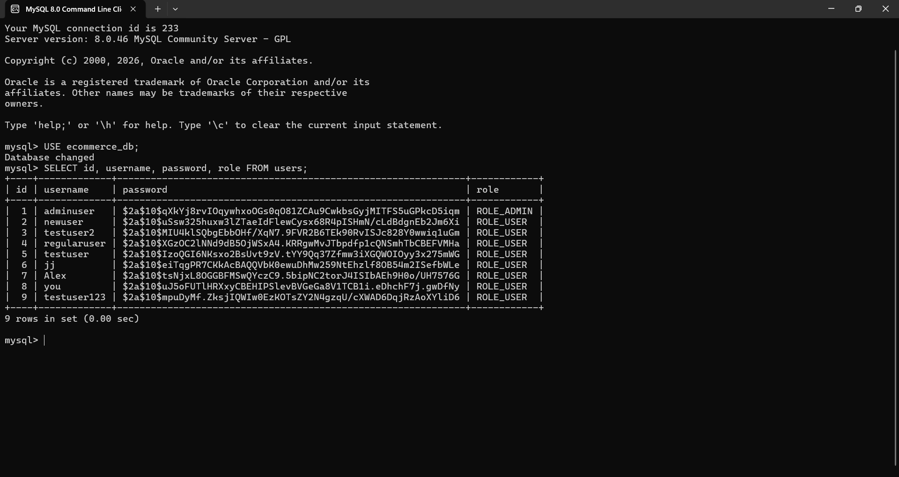
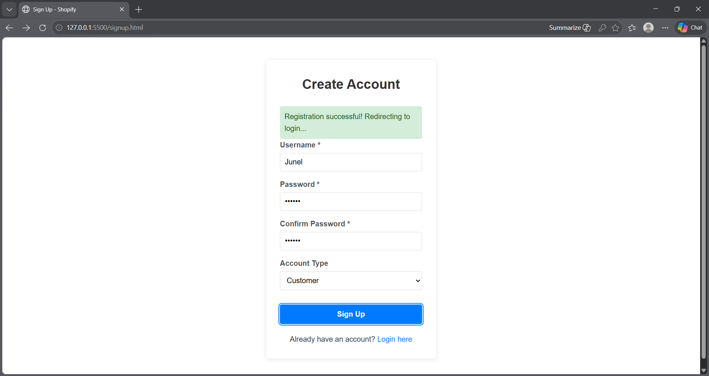
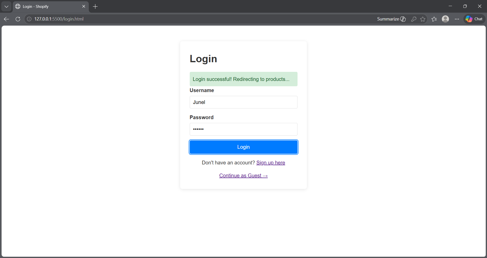
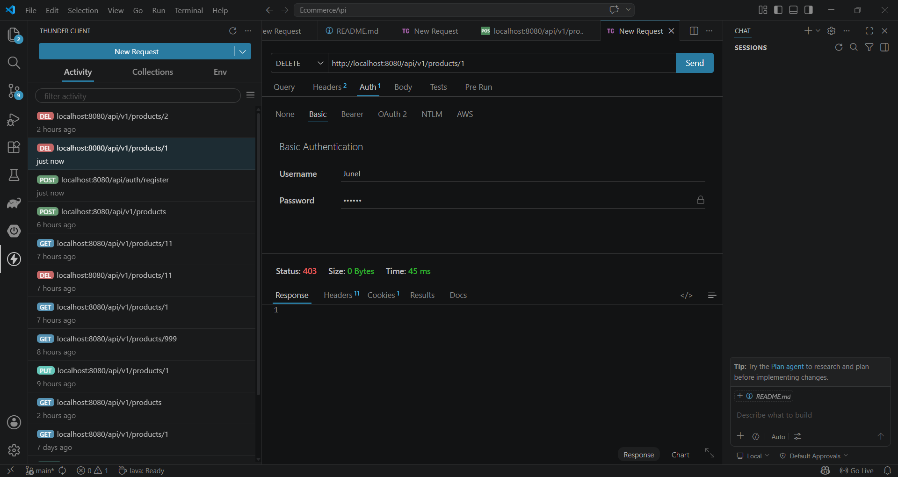

# Ecommerce API - Spring Boot REST API

## Overview
A complete RESTful API for managing e-commerce products built with Spring Boot, featuring **JWT Authentication**, role-based authorization, MySQL database persistence, and integrated frontend.

## Technologies Used
- Java 21
- Spring Boot 4.0.6
- Spring Security with JWT
- Spring Data JPA
- MySQL 8.0
- Gradle
- Lombok
- Spring Validation
- JJWT

## Security Features

### Authentication (JWT - Stateless)
- **User Registration:** `POST /api/auth/register`
- **User Login:** `POST /api/auth/login` (returns JWT token)
- **Token Storage:** Client stores token in localStorage
- **Token Format:** Bearer token in Authorization header
- **Token Expiration:** 24 hours
- **Password Hashing:** BCrypt (10 rounds)

### Authorization (Role-Based)
| Role | Permissions |
|------|-------------|
| `ROLE_USER` | View products |
| `ROLE_ADMIN` | View, create, update, and delete products |

### Protected Endpoints
| Endpoint | Access |
|----------|--------|
| `GET /api/v1/products` | Public |
| `POST /api/v1/products` | ADMIN only |
| `PUT /api/v1/products/{id}` | ADMIN only |
| `DELETE /api/v1/products/{id}` | ADMIN only |
| `POST /api/auth/register` | Public |
| `POST /api/auth/login` | Public |

## JWT Authentication Flow

1. User registers → `POST /api/auth/register`
2. User logs in → `POST /api/auth/login` with username/password
3. Server validates credentials → Returns JWT token
4. Client stores token in localStorage
5. Client sends token in Authorization header: `Bearer <token>`
6. Server validates token on each request
7. Token expires after 24 hours → User must re-authenticate

## Database Setup

### Prerequisites
- MySQL 8.0+ installed and running

### Create Database
```sql
CREATE DATABASE ecommerce_db;
```

### Application Properties
```properties
spring.application.name=EcommerceApi

spring.datasource.url=jdbc:mysql://localhost:3306/ecommerce_db?useSSL=false&serverTimezone=UTC&allowPublicKeyRetrieval=true
spring.datasource.username=root
spring.datasource.password=your_password
spring.datasource.driver-class-name=com.mysql.cj.jdbc.Driver

spring.jpa.hibernate.ddl-auto=update
spring.jpa.show-sql=true
spring.jpa.properties.hibernate.dialect=org.hibernate.dialect.MySQLDialect
spring.jpa.properties.hibernate.format_sql=true

server.port=8080

jwt.secret=your-very-strong-secret-key-that-is-at-least-32-characters-long-for-hs256
jwt.expiration=86400000
```

## How to Run

### Backend
1. Clone the repository
2. Open in VS Code or IntelliJ IDEA
3. Update `application.properties` with your MySQL credentials
4. Run `EcommerceApiApplication.java` (green play button)
5. The API will start at `http://localhost:8080`

### Frontend
The frontend is served directly from the backend's `static` folder:
1. Start the backend server
2. Open browser to `http://localhost:8080/signup.html`
3. Register a new user account
4. Login at `http://localhost:8080/login.html`
5. Browse products at `http://localhost:8080/products.html`

## API Endpoints

### Public Endpoints (No Auth Required)
| Method | Endpoint | Description |
|--------|----------|-------------|
| GET | `/api/v1/products` | Get all products |
| GET | `/api/v1/products/{id}` | Get product by ID |
| POST | `/api/auth/register` | Register a new user |
| POST | `/api/auth/login` | Login and get JWT token |

### Protected Endpoints (ADMIN only)
| Method | Endpoint | Description |
|--------|----------|-------------|
| POST | `/api/v1/products` | Create new product |
| PUT | `/api/v1/products/{id}` | Update product |
| DELETE | `/api/v1/products/{id}` | Delete product |

## Sample Requests

### Register a User (POST)
**URL:** `http://localhost:8080/api/auth/register`

**Body:**
```json
{
    "username": "newuser",
    "password": "password123",
    "role": "ROLE_USER"
}
```

**Response (201 Created):**
```json
{
    "message": "User registered successfully!"
}
```

### Login (POST)
**URL:** `http://localhost:8080/api/auth/login`

**Body:**
```json
{
    "username": "newuser",
    "password": "password123"
}
```

**Response (200 OK):**
```json
{
    "token": "eyJhbGciOiJIUzI1NiJ9...",
    "username": "newuser",
    "role": "ROLE_USER",
    "message": "Login successful"
}
```

### Get Products with JWT (GET)
**URL:** `http://localhost:8080/api/v1/products`

**Headers:** `Authorization: Bearer <your-token-here>`

### Create Product (ADMIN only)
**URL:** `http://localhost:8080/api/v1/products`

**Headers:** `Content-Type: application/json`, `Authorization: Bearer <admin-token>`

**Body:**
```json
{
    "name": "New Product",
    "description": "Product description",
    "price": 1999,
    "category": "Electronics",
    "stockQuantity": 10,
    "imageUrl": "product.jpg"
}
```

## Error Responses

### Authentication Failed (401)
```json
{
    "status": 401,
    "error": "Unauthorized",
    "message": "Invalid username or password"
}
```

### Invalid Token (401)
```json
{
    "status": 401,
    "error": "Unauthorized",
    "message": "JWT token is invalid or expired"
}
```

### Access Denied (403)
```json
{
    "status": 403,
    "error": "Access Denied",
    "message": "You do not have permission to access this resource"
}
```

### Product Not Found (404)
```json
{
    "timestamp": "2026-05-07T...",
    "status": 404,
    "error": "Not Found",
    "message": "Product with ID 99 not found",
    "path": "/api/v1/products/99"
}
```

### Validation Error (400)
```json
{
    "status": 400,
    "error": "Validation Failed",
    "validationErrors": {
        "name": "Product name is required",
        "price": "Price must be greater than 0"
    }
}
```

## Database Schema

### Users Table
| Column | Type | Description |
|--------|------|-------------|
| id | BIGINT | Primary key (auto-increment) |
| username | VARCHAR(255) | Unique username |
| password | VARCHAR(255) | BCrypt hashed password |
| role | VARCHAR(50) | ROLE_USER or ROLE_ADMIN |

### Products Table
| Column | Type | Description |
|--------|------|-------------|
| id | BIGINT | Primary key (auto-increment) |
| name | VARCHAR(100) | Product name |
| description | VARCHAR(500) | Product description |
| price | DOUBLE | Product price |
| category | VARCHAR(100) | Category name |
| stock_quantity | INT | Available stock |
| image_url | VARCHAR(255) | Product image filename |

## Screenshots

### Database Users Table


### User Registration


### User Login


### Unauthorized DELETE (403)


## Frontend Integration

The frontend is served from `src/main/resources/static/` and includes:
- **Signup page** (`/signup.html`) - User registration
- **Login page** (`/login.html`) - User authentication (returns JWT)
- **Products page** (`/products.html`) - Displays products with user greeting and role

Credentials are stored in `localStorage` and sent with each API request using the Bearer token format.

## Known Limitations
- JWT tokens cannot be revoked until expiration
- No refresh token mechanism
- No password reset functionality
- No email verification

## Author
Balanquit, Junel M. & Balansag, Geraldine R.

## Submission Date
May 2026